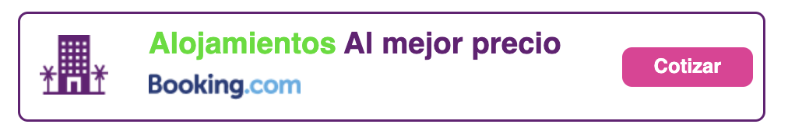
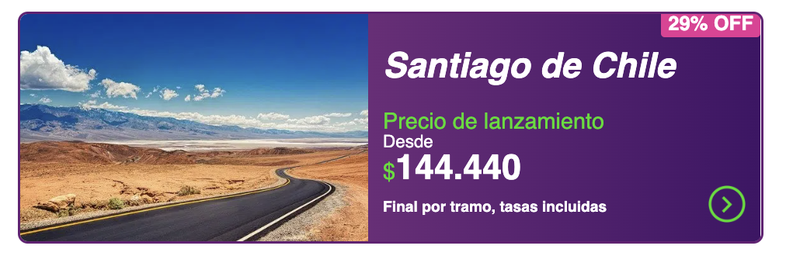
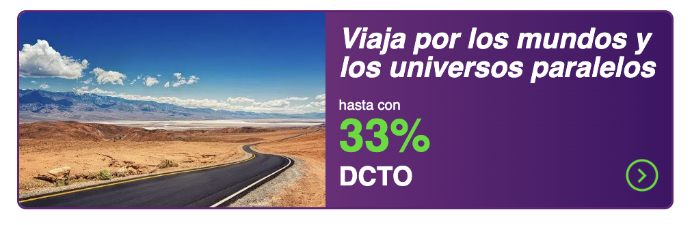
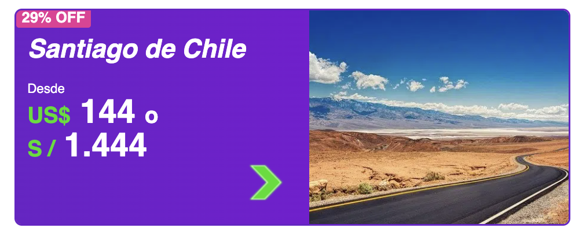
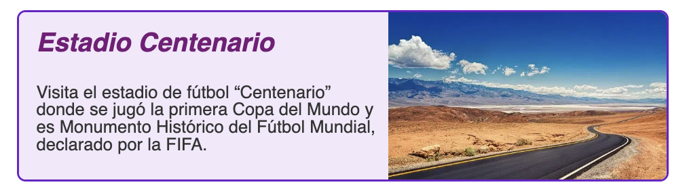
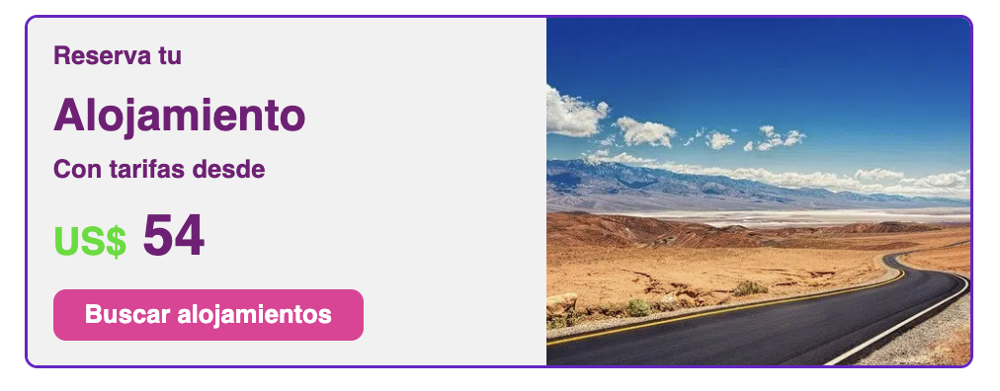
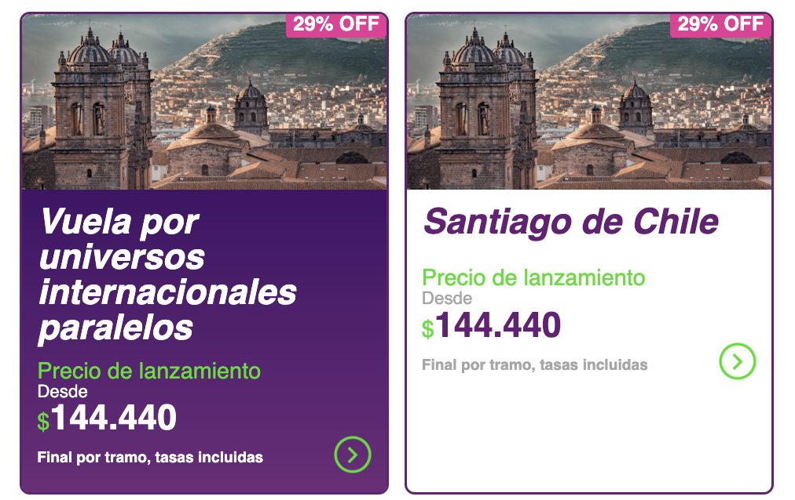
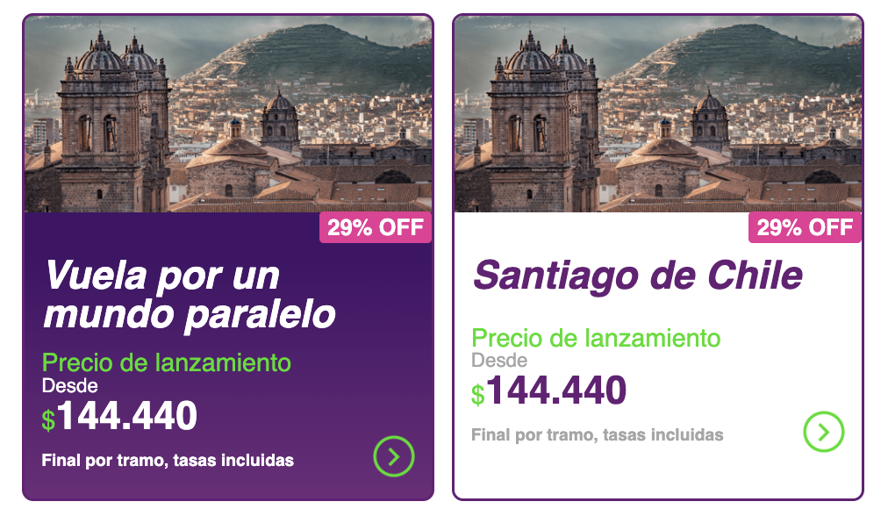
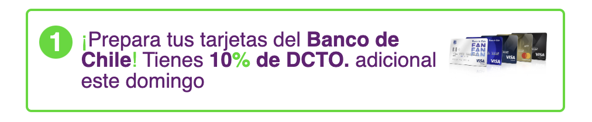
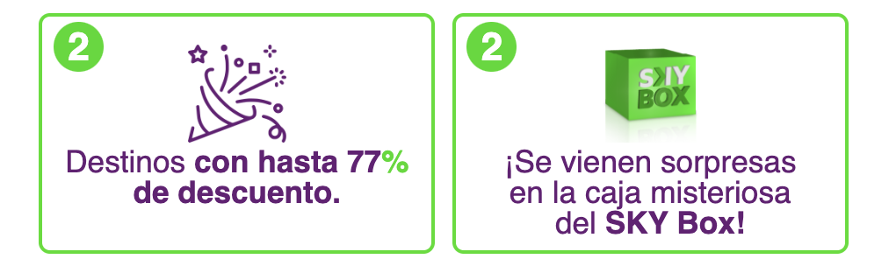

# mail-html-components

### Alojamiento caluga



<details>

<summary>Code</summary>

```
<div align="center" style="padding:12px 0;">
  <a style="text-decoration:none;" target="_blank" href="https://google.com">
    <div align="left"
      style="border:2px solid #671E75;max-width:600px;margin:auto;border-radius:8px;overflow:hidden;display:flex">
      <table style="width:100%;">
        <tbody>
          <tr>
            <td style="padding:12px 16px;">
              
            </td>
            <td style="font-size:24px;font-weight:bold;padding:12px 8px;">
              <p style="color:#26DE00;margin-bottom:12px;">Alojamientos
                <span style="color:#671E75;">Al mejor precio</span>
              </p>
              
            </td>
            <td style="padding:16px 8px;text-align:center;">
              <a class="btn"
                style="display:block;text-decoration:none!important;font-size:16px!important;font-weight:bold!important;padding:8px 20px!important;color:#fff!important;background-color:#EA3397!important;border-radius:8px!important;"
                href="https://www.google.com/" target="_blank">Cotizar</a>
            </td>
          </tr>
        </tbody>
      </table>
    </div>
  </a>
</div>

<style>
  * {
    font-family: 'Roboto', sans-serif;
    box-sizing: border-box;
    border-collapse: collapse;
    line-height: 1;
    border-spacing: 0;
    margin: 0;
    padding: 0;
  }

  .btn {
    display: block;
    text-decoration: none !important;
    font-size: 16px !important;
    font-weight: bold !important;
    padding: 8px 20px !important;
    color: #fff !important;
    background-color: #EA3397 !important;
    border-radius: 8px !important;
  }
</style>
```

</details>

### Caluga horizontal 1



<details>

<summary>Code</summary>

```
<div align="center" style="padding:12px 0;">
  <a style="text-decoration:none;" target="_blank" href="https://google.com">
    <div align="left"
      style="border:2px solid #671E75;max-width:600px;margin:auto;border-radius:8px;overflow:hidden;display:flex">
      

      <div style="width:53% !important;background:linear-gradient(90deg, #6F2B7A, #411367);background-color:#671E75;">
        <p style="text-align:end;">
          <span style="color:#fff;font-size:16px;font-weight:bold;padding:2px 6px;background-color:#EA3397;border-radius:3px;">29% OFF</span>
        </p>

        <div style="padding:12px;">
          <h2 style="color:#fff;font-size:28px;font-style:italic;min-height:50px;padding-bottom:12px;">Santiago de Chile
          </h2>
          <p style="color:#26DE00;font-size:18px;margin:0;">Precio de lanzamiento</p>
          <p style="color:#fff;font-size:14px;">Desde</p>
          <h3 style="color:#FFF;font-size:28px;color:#fff;font-weight:bold;">
            <span style="color:#26DE00;font-size:18px;font-weight:normal;">$</span>144.440
          </h3>

          <table style="width:100%;">
            <tbody>
              <tr>
                <td>
                  <span style="font-size:12px;color:#fff;font-weight:bold;">Final por tramo, tasas incluidas</span>
                </td>
                <td align="right">
                  
                </td>
              </tr>
            </tbody>
          </table>
        </div>
      </div>
    </div>
  </a>
</div>

<style>
  * {
    font-family: 'Roboto', sans-serif;
    box-sizing: border-box;
    border-collapse: collapse;
    line-height: 1;
    border-spacing: 0;
    margin: 0;
    padding: 0;
  }
</style>
```

</details>

### Caluga horizontal 2



<details>

<summary>Code</summary>

```
<div align="center" style="padding:12px 0;">
  <a style="text-decoration:none;" target="_blank" href="https://google.com">
    <div align="left"
      style="border:2px solid #671E75;max-width:600px;margin:auto;border-radius:8px;overflow:hidden;display:flex">
      

      <div style="width:53% !important;background:linear-gradient(90deg, #6F2B7A, #411367);background-color:#671E75;">

        <div style="padding:12px;">
          <h2 style="color:#fff;font-size:26px;font-style:italic;min-height:50px;padding-bottom:12px;">Viaja
            por los mundos y
            los universos paralelos</h2>
          <p><span style="color:#fff;font-size:13px;">hasta con</span></p>
          <h3 style="color:#FFF;font-size:42px;color:#26DE00;font-weight:bold;">33%</h3>

          <table style="width:100%;">
            <tbody>
              <tr>
                <td>
                  <span style="font-size:24px;color:#fff;font-weight:bold;">DCTO</span>
                </td>
                <td align="right">
                  
                </td>
              </tr>
            </tbody>
          </table>
        </div>
      </div>
    </div>
  </a>
</div>

<style>
  * {
    font-family: 'Roboto', sans-serif;
    box-sizing: border-box;
    border-collapse: collapse;
    line-height: 1;
    border-spacing: 0;
    margin: 0;
    padding: 0;
  }
</style>
```

</details>

### Caluga horizontal 3



<details>

<summary>Code</summary>

```
<div align="center" style="padding:12px 0;">
  <a style="text-decoration:none;" target="_blank" href="https://google.com">
    <div align="left"
      style="border:2px solid #6D20C9;max-width:600px;margin:auto;border-radius:8px;overflow:hidden;display:flex">

      <div style="width:53% !important;background:linear-gradient(90deg, #6D20C9, #7917D3);background-color:#671E75;">
        <p style="text-align:start;">
          <span style="color:#fff;font-size:16px;font-weight:bold;padding:2px 6px;background-color:#EA3397;border-radius:3px;">29% OFF</span>
        </p>

        <div style="padding:12px;">
          <h2 style="color:#fff;font-size:28px;font-style:italic;min-height:50px;padding-bottom:12px;">Santiago de Chile
          </h2>
          <p style="color:#fff;font-size:14px;">Desde</p>
          <h3 style="color:#FFF;font-size:36px;color:#fff;font-weight:bold;">
            <span style="color:#26DE00;font-size:24px;">US$</span>
            144
            <span style="font-size:24px;">o</span>
          </h3>
          <h3 style="color:#FFF;font-size:36px;font-weight:bold;">
            <span style="color:#26DE00;font-size:24px;">S /</span>
            1.444
          </h3>

          <div align="right" style="padding-bottom:8px;padding-right:12px;">
            <div style="width:20%">
            
            </div>
          </div>
        </div>
      </div>

      
    </div>
  </a>
</div>

<style>
  * {
    font-family: 'Roboto', sans-serif;
    box-sizing: border-box;
    border-collapse: collapse;
    line-height: 1;
    border-spacing: 0;
    margin: 0;
    padding: 0;
  }
</style>
```

</details>

### Caluga horizontal 4



<details>

<summary>Code</summary>

```
<div align="center" style="padding:12px 0;">
  <a style="text-decoration:none;" target="_blank" href="https://google.com">
    <div align="left"
      style="border:2px solid #6D20C9;max-width:600px;margin:auto;border-radius:8px;overflow:hidden;display:flex">

      <div style="width:57% !important;background:#F3E8FB;">
        <div style="padding:16px 4px 24px 16px;">
          <h2 style="color:#781878;font-size:24px;font-style:italic;min-height:50px;padding-bottom:12px;">Estadio
            Centenario</h2>
          <p style="color:#333;font-size:16px;">Visita el estadio de fútbol “Centenario” donde se jugó la primera Copa
            del Mundo y es Monumento Histórico del Fútbol Mundial, declarado por la FIFA.</p>
        </div>
      </div>

      
    </div>
  </a>
</div>

<style>
  * {
    font-family: 'Roboto', sans-serif;
    box-sizing: border-box;
    border-collapse: collapse;
    line-height: 1;
    border-spacing: 0;
    margin: 0;
    padding: 0;
  }
</style>
```

</details>

### Caluga horizontal 5



<details>

<summary>Code</summary>

```
<div align="center" style="padding:12px 0;">
  <a style="text-decoration:none;" target="_blank" href="https://google.com">
    <div align="left"
      style="border:2px solid #6D20C9;max-width:600px;margin:auto;border-radius:8px;overflow:hidden;display:flex">

      <div style="width:55% !important;background:#f1f1f1;">
        <div style="padding:16px 4px 16px 16px">
          <h4 style="color:#781878;font-size:16px;font-weight:bold;padding-bottom:16px;">Reserva tu
          </h4>
          <h2 style="color:#781878;font-size:28px;padding-bottom:12px;">Alojamiento
          </h2>
          <h4 style="color:#781878;font-size:16px;padding-bottom:16px;">Con tarifas desde</h4>
          <h3 style="color:#781878;font-size:36px;font-weight:bold;padding-bottom:16px">
            <span style="color:#26DE00;font-size:24px;">US$</span>
            54
          </h3>
          <table>
            <tr>
              <td>
                <a class="btn"
                  style="display:block;text-decoration:none!important;font-size:16px!important;font-weight:bold!important;padding:8px 20px!important;color:#fff!important;background-color:#EA3397!important;border-radius:8px!important;"
                  href="https://www.google.com/" target="_blank">Buscar alojamientos</a>
              </td>
            </tr>
          </table>

        </div>
      </div>

      
    </div>
  </a>
</div>

<style>
  * {
    font-family: 'Roboto', sans-serif;
    box-sizing: border-box;
    border-collapse: collapse;
    line-height: 1;
    border-spacing: 0;
    margin: 0;
    padding: 0;
  }

  .btn {
    display:block;
    text-decoration: none !important;
    font-size: 16px !important;
    font-weight: bold !important;
    padding: 8px 20px !important;
    color: #fff !important;
    background-color: #EA3397 !important;
    border-radius: 8px !important;
  }
</style>
```

</details>

### Calugas Vertical 1 (descuento arriba)



<details>

<summary>Code</summary>

```
<div align="center" style="padding:12px 0;">
  <div align="left" style="max-width:600px;margin:auto;display:flex;">
    <div style="padding-right:6px;width:50%;">
      <a style="text-decoration:none;" target="_blank" href="https://google.com">
        <div style="border:2px solid #671E75;border-radius:8px;overflow:hidden;height:100% !important;">
          <div title="Vuela por Arequipa"
            style="background-image:url(https://mcusercontent.com/8c80a2f03d32edc6cafad47df/images/57a1c34e-2f82-c707-cf49-5785e5050d54.png);background-position:center center;background-size:cover;height:140px !important;">
            <p style="margin:0;text-align:end;color:#fff;font-size:16px;font-weight:bold;">
              <span style="padding:2px 6px;background-color:#EA3397;border-radius:3px;">29% OFF</span>
            </p>
          </div>

          <div style="padding:12px;background:linear-gradient(0deg, #6F2B7A, #411367);background-color:#531364;">
            <h2 style="color:#fff;font-size:28px;font-style:italic;min-height:50px;padding-bottom:12px;">Vuela por
              universos internacionales paralelos
            </h2>
            <p style="color:#26DE00;font-size:18px;margin:0;">Precio de lanzamiento</p>
            <p style="color:#fff;font-size:14px;">Desde</p>
            <h3 style="color:#FFF;font-size:28px;color:#fff;font-weight:bold;">
              <span style="color:#26DE00;font-size:18px;font-weight:normal;">$</span>144.440
            </h3>

            <table style="width:100%;">
              <tbody>
                <tr>
                  <td>
                    <span style="font-size:12px;color:#fff;font-weight:bold;">Final por tramo, tasas incluidas</span>
                  </td>
                  <td align="right">
                    
                  </td>
                </tr>
              </tbody>
            </table>
          </div>
        </div>
      </a>
    </div>
    <div style="padding-left:6px;width:50%;">
      <a style="text-decoration:none;" target="_blank" href="https://google.com">
        <div style="border:2px solid #671E75;border-radius:8px;overflow:hidden;height:100% !important;">
          <div title="Vuela por Arequipa"
            style="background-image:url(https://mcusercontent.com/8c80a2f03d32edc6cafad47df/images/57a1c34e-2f82-c707-cf49-5785e5050d54.png);background-position:center center;background-size:cover;height:140px !important;">
            <p style="margin:0;text-align:end;color:#fff;font-size:16px;font-weight:bold;">
              <span style="padding:2px 6px;background-color:#EA3397;border-radius:3px;">29% OFF</span>
            </p>
          </div>

          <div style="padding:12px;">
            <h2 style="color:#671E75;font-size:28px;font-style:italic;min-height:50px;padding-bottom:12px;">Santiago
              de Chile
            </h2>
            <p style="color:#26DE00;font-size:18px;margin:0;">Precio de lanzamiento</p>
            <p style="color:#a6a6a6;font-size:14px;">Desde</p>
            <h3 style="color:#FFF;font-size:28px;color:#671E75;font-weight:bold;">
              <span style="color:#26DE00;font-size:18px;font-weight:normal;">$</span>144.440
            </h3>

            <table style="width:100%;">
              <tbody>
                <tr>
                  <td>
                    <span style="font-size:12px;color:#a6a6a6;font-weight:bold;">Final por tramo, tasas incluidas</span>
                  </td>
                  <td align="right">
                    
                  </td>
                </tr>
              </tbody>
            </table>
          </div>
        </div>
      </a>
    </div>
  </div>
</div>

<style>
  * {
    font-family: 'Roboto', sans-serif;
    box-sizing: border-box;
    border-collapse: collapse;
    line-height: 1;
    border-spacing: 0;
    margin: 0;
    padding: 0;
  }
</style>
```

</details>

### Calugas Vertical 2 (descuento abajo)



<details>

<summary>Code</summary>

```
<div align="center" style="padding:12px 0;">
  <div align="left" style="max-width:600px;margin:auto;display:flex;">
    <div style="width:50%;padding-right:6px;">
      <a style="text-decoration:none;" target="_blank" href="https://google.com">
        <div
          style="border:2px solid #671E75;border-radius:8px;overflow:hidden;background:linear-gradient(0deg, #6F2B7A, #411367 50%);background-color:#531364;height:100% !important;">
          

          <p style="margin:0;text-align:end;color:#fff;font-size:16px;font-weight:bold;">
            <span style="padding:2px 6px;background-color:#EA3397;border-radius:3px;">29% OFF</span>
          </p>

          <div style="padding:12px;">
            <h2 style="color:#fff;font-size:28px;font-style:italic;min-height:50px;padding-bottom:12px;">Vuela por
              un mundo paralelo
            </h2>
            <p style="color:#26DE00;font-size:18px;margin:0;">Precio de lanzamiento</p>
            <p style="color:#fff;font-size:14px;">Desde</p>
            <h3 style="color:#FFF;font-size:28px;color:#fff;font-weight:bold;">
              <span style="color:#26DE00;font-size:18px;font-weight:normal;">$</span>144.440
            </h3>

            <table style="width:100%;">
              <tbody>
                <tr>
                  <td>
                    <span style="font-size:12px;color:#fff;font-weight:bold;">Final por tramo, tasas incluidas</span>
                  </td>
                  <td align="right">
                    
                  </td>
                </tr>
              </tbody>
            </table>
          </div>
        </div>
      </a>
    </div>
    <div style="width:50%;padding-left:6px;">
      <a style="text-decoration:none;" target="_blank" href="https://google.com">
        <div style="border:2px solid #671E75;border-radius:8px;overflow:hidden;background:#fff;height:100% !important;">
          

          <p style="margin:0;text-align:end;color:#fff;font-size:16px;font-weight:bold;">
            <span style="padding:2px 6px;background-color:#EA3397;border-radius:3px;">29% OFF</span>
          </p>

          <div style="padding:12px;">
            <h2 style="color:#671E75;font-size:28px;font-style:italic;min-height:50px;padding-bottom:12px;">Santiago
              de Chile
            </h2>
            <p style="color:#26DE00;font-size:18px;margin:0;">Precio de lanzamiento</p>
            <p style="color:#a6a6a6;font-size:14px;">Desde</p>
            <h3 style="color:#FFF;font-size:28px;color:#671E75;font-weight:bold;">
              <span style="color:#26DE00;font-size:18px;font-weight:normal;">$</span>144.440
            </h3>

            <table style="width:100%;">
              <tbody>
                <tr>
                  <td>
                    <span style="font-size:12px;color:#a6a6a6;font-weight:bold;">Final por tramo, tasas incluidas</span>
                  </td>
                  <td align="right">
                    
                  </td>
                </tr>
              </tbody>
            </table>
          </div>
        </div>
      </a>
    </div>
  </div>
</div>

<style>
  * {
    font-family: 'Roboto', sans-serif;
    box-sizing: border-box;
    border-collapse: collapse;
    line-height: 1;
    border-spacing: 0;
    margin: 0;
    padding: 0;
  }
</style>
```

</details>

### Escalonado 1


<details>

<summary>Code</summary>

```
<div align="center" style="padding:12px 0;">
  <div align="right" style="margin:auto;max-width:600px;">
    <div style="width:80%;border-radius:8px;overflow:hidden;border:2px solid #671E75;">
      <table width="100%">
        <tbody>
          <tr>
            <td align="center" style="background:#671E75;color:#fff;font-weight:bold;padding:6px 0;">
              <p style="font-size:48px;">10%</p>
              <p style="font-size:24px;">DCTO.</p>
            </td>
            <td align="right" style="padding:6px 12px 6px 0;">
              <p style="color:#671E75;font-size:28px;font-weight:bold;margin-bottom:8px;">2 pasajeros</p>
              <p style="color:#671E75;font-size:16px;">Con el cupón:</p>
              <p style="color:#26DA04;font-size:20px;font-weight:500;">SKY10SALE</p>
            </td>
          </tr>
        </tbody>
      </table>
    </div>
  </div>
</div>

<style>
  * {
    font-family: 'Roboto', sans-serif;
    box-sizing: border-box;
    border-collapse: collapse;
    line-height: 1;
    border-spacing: 0;
    margin: 0;
    padding: 0;
  }
</style>
```

</details>

### Escalonado 2


<details>

<summary>Code</summary>

```
<div align="center" style="padding:12px 0;">
  <div align="right" style="margin:auto;max-width:600px;">
    <div style="width:90%;border-radius:8px;overflow:hidden;border:2px solid #671E75;">
      <table width="100%">
        <tbody>
          <tr>
            <td align="center" style="background:#671E75;color:#fff;font-weight:bold;padding:6px 0;">
              <p style="font-size:48px;">10%</p>
              <p style="font-size:24px;">DCTO.</p>
            </td>
            <td align="right" style="padding:6px 12px 6px 0;">
              <p style="color:#671E75;font-size:28px;font-weight:bold;margin-bottom:8px;">2 pasajeros</p>
              <p style="color:#671E75;font-size:16px;">Con el cupón:</p>
              <p style="color:#26DA04;font-size:20px;font-weight:500;">SKY10SALE</p>
            </td>
          </tr>
        </tbody>
      </table>
    </div>
  </div>
</div>

<style>
  * {
    font-family: 'Roboto', sans-serif;
    box-sizing: border-box;
    border-collapse: collapse;
    line-height: 1;
    border-spacing: 0;
    margin: 0;
    padding: 0;
  }
</style>
```

</details>

### Escalonado 3


<details>

<summary>Code</summary>

```
<div align="center" style="padding:12px 0;">
  <div align="right" style="margin:auto;max-width:600px;">
    <div style="width:100%;border-radius:8px;overflow:hidden;border:2px solid #671E75;">
      <table width="100%">
        <tbody>
          <tr>
            <td align="center" style="background:#671E75;color:#fff;font-weight:bold;padding:6px 0;">
              <p style="font-size:48px;">10%</p>
              <p style="font-size:24px;">DCTO.</p>
            </td>
            <td align="right" style="padding:6px 12px 6px 0;">
              <p style="color:#671E75;font-size:28px;font-weight:bold;margin-bottom:8px;">2 pasajeros</p>
              <p style="color:#671E75;font-size:16px;">Con el cupón:</p>
              <p style="color:#26DA04;font-size:20px;font-weight:500;">SKY10SALE</p>
            </td>
          </tr>
        </tbody>
      </table>
    </div>
  </div>
</div>

<style>
  * {
    font-family: 'Roboto', sans-serif;
    box-sizing: border-box;
    border-collapse: collapse;
    line-height: 1;
    border-spacing: 0;
    margin: 0;
    padding: 0;
  }
</style>
```

</details>

### 2 Fotos


<details>

<summary>Code</summary>

```
<div align="center" style="padding:12px 0;">
  <div align="left" style="max-width:600px;margin:auto;">
    <table>
      <tbody>
        <tr>
          <td style="width:50%;padding-right:12px;">
            <a style="text-decoration:none;"
              href="https://google.com"
              target="_blank">
              
            </a>
          </td>
          <td style="width:50%;padding-left:12px;">
            <a style="text-decoration:none;"
              href="https://google.com"
              target="_blank">
              
            </a>
          </td>
        </tr>
      </tbody>
    </table>
  </div>
</div>

<style>
  * {
    font-family: 'Roboto', sans-serif;
    box-sizing: border-box;
    border-collapse: collapse;
    line-height: 1;
    border-spacing: 0;
    margin: 0;
    padding: 0;
  }
</style>
```

</details>

### 1 Foto


<details>

<summary>Code</summary>

```
<div align="center" style="padding:12px 0;">
  <div align="left" style="max-width:600px;margin:auto;">
    <a style="text-decoration:none;"
      href="https://google.com"
      target="_blank">
      
    </a>
  </div>
</div>

<style>
  * {
    font-family: 'Roboto', sans-serif;
    box-sizing: border-box;
    border-collapse: collapse;
    line-height: 1;
    border-spacing: 0;
    margin: 0;
    padding: 0;
  }
</style>
```

</details>

### Caluga Teaser 1



<details>

<summary>Code</summary>

```
<div align="center" style="padding:12px 0;">
  <div align="left" style="max-width:600px;margin:auto;">
    <a style="text-decoration:none;"
      href="https://google.com"
      target="_blank">
      
    </a>
  </div>
</div>

<style>
  * {
    font-family: 'Roboto', sans-serif;
    box-sizing: border-box;
    border-collapse: collapse;
    line-height: 1;
    border-spacing: 0;
    margin: 0;
    padding: 0;
  }
</style>
```

</details>

### Caluga Teaser 2



<details>

<summary>Code</summary>

```
<div align="center"
  style="margin:auto;padding:12px;max-width:600px;-webkit-text-size-adjust:100%;-ms-text-size-adjust:100%;">
  <table style="width:100%;height:100%;">
    <tbody>
      <tr>
        <td style="width:50%;padding-right:6px;">
          <div style="padding:8px;border-radius:8px;overflow:hidden;border:3px solid #26DE00;height:100%;">
            <table style="width:100%">
              <tr>
                <td valign='top' style="width:25%">
                  <span style="font-size:28px;font-weight:bold;color:#fff;background:#26DA04;border-radius:50%;padding:2px 10px;">2</span>
                </td>
                <td align="center" style="width:50%;padding-top:12px">
                  
                </td>
                <td style="width:25%">
                </td>
              </tr>
            </table>
            
            <p style="color:#671E75;font-size:22px;line-height:1;text-align:center;">
              Destinos <b>con hasta 77<span style="color:#26DA04">%</span> de descuento.</b>
            </p>
          </div>
        </td>

        <td style="width:50%;padding-left:6px;">
          <div style="padding:8px;border-radius:8px;overflow:hidden;border:3px solid #26DE00;height:100%;">
            <table style="width:100%">
              <tr>
                <td valign='top' style="width:25%">
                  <span style="font-size:28px;font-weight:bold;color:#fff;background:#26DA04;border-radius:50%;padding:2px 10px;">2</span>
                </td>
                <td align="center" style="width:50%;padding-top:12px">
                  
                </td>
                <td style="width:25%">
                </td>
              </tr>
            </table>

            <p style="color:#671E75;font-size:22px;line-height:1;text-align:center;">
              ¡Se vienen sorpresas<br>en la caja misteriosa <br>del <b>SKY Box!</b>
            </p>
          </div>
        </td>
      </tr>
    </tbody>
  </table>
</div>

<style>
  * {
    font-family: 'Roboto', sans-serif;
    box-sizing: border-box;
    border-collapse: collapse;
    line-height: 1;
    border-spacing: 0;
    margin: 0;
    padding: 0;
  }
</style>
```

</details>
